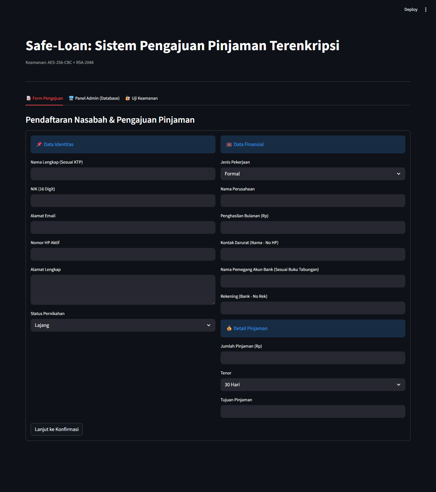

# 🔐 Safe-Loan: Implementasi AES-256 dan RSA-2048 untuk Pengamanan Data Nasabah Pinjaman Digital Berbasis Web 🔐

Aplikasi berbasis web yang mengimplementasikan **Sistem Kriptografi Hibrida** (AES-256 mode CBC dan RSA-2048 skema PKCS1_OAEP) untuk mengamankan data sensitif nasabah pinjaman digital pada level *Data-at-Rest* (database)[cite: 1]. Proyek ini disusun untuk memenuhi tugas mata kuliah **Kriptografi** di Universitas Bina Sarana Informatika.

## 👨‍💻 Pengembang[cite: 1]

* Muhamad Rianda (17230124)
* Zaky Daffa Fiddien (17230060)
* Taher Abdul Azis (17230226)
* Aura Safitri Rahmadhani (17230234)
* Nazwa Elfarany Jamal (17230401)

## 💡 Persyaratan Sistem & Basis Data

* Python 3.11.5
* Database Server MySQL (`db_fintech`)
* Pasangan Kunci Eksternal (`public_key.pem` dan `private_key.pem`)

## 🛠️ Framework & Pustaka Utama

* **Framework Web:** Streamlit
* **Pustaka Kriptografi:** PyCryptodome (`Crypto.Cipher.AES`, `Crypto.Cipher.PKCS1_OAEP`, `Crypto.PublicKey.RSA`, `Crypto.Util.Padding`)
* **Konektor Database:** `mysql-connector-python`

## 🛠️ Referensi & Tools

* Visual Studio Code
* Git & GitHub
